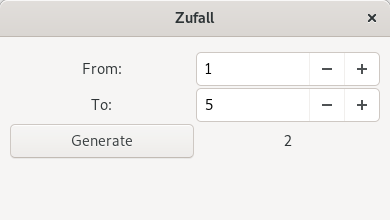

# zufall 

Zufall, a tool to help on decisions.

Version: rolling

This project was an entry into rust for me and for now it is feature complete, so there won't be any more features.
You can still open feature requests, but they will be closed.
But if I continue developing at any time, I will take them into mind.
I will still make updates of dependencies and bug fixes.

Actually this is the repo where I play and test GitHub features.
That's why I rested (delete & create) this repo end of november 2020.

## Installing

### build dependencies

  * cargo + rustc
  * GTK+, GLib and Cairo development files,  
    see [here](http://gtk-rs.org/docs/requirements.html)

Fedora: `sudo dnf install cargo gtk3-devel glib2-devel`  
Debian/Ubuntu/Mint: `sudo apt install cargo libgtk-3-dev`  
ArchLinux: `sudo pacman -S rust gtk3`  
OpenSUSE: `sudo zypper install cargo gtk3-devel glib2-devel`

### downloading

    git clone https://github.com/rusty-snake/zufall.git zufall
    cd zufall

### builing and installing

    ./build.sh
    sudo ./install.sh

#### uninstalling

    sudo ./uninstall.sh

### running

    zufall cli 1 3
    zufall gui

## License
[MIT](LICENSE)
